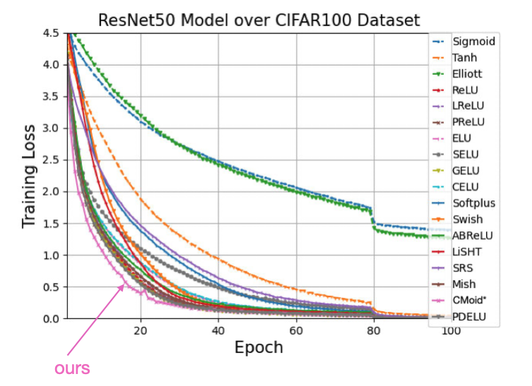
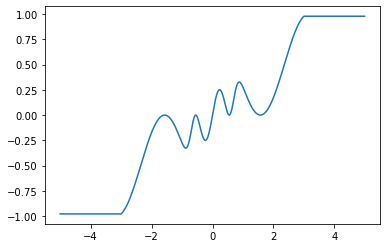

This is an implementation of the cyclemoid activation function for PyTorch. 


The cyclemoid function achieved state-of-the-art results in a recent benchmark with other popular activation functions as shown below:





**Note that this is a figure from the paper submitted on April 1st, 2022. An arxiv preprint will be uploaded soon.**


## Installation


You can install the cyclemoid-pytorch package via

```python
pip install cyclemoid_pytorch
```


## Usage

This package implements a `CycleMoid` class and a `cyclemoid` function. You can use these are drop-in replacements for any activation in PyTorch. For example


```python
from cyclemoid_pytorch import CycleMoid

torch.nn.Sequential(
    # ...,
    CycleMoid(), # instead of torch.nn.ReLU()
    # ...
    )
```

or

```python
from cyclemoid_pytorch import cyclemoid

# ...
def forward(self, x):
    # ...
    x = cyclemoid(x) # instead of torch.sigmoid(x)
```


## Visualization


```python
import matplotlib.pyplot as plt
import torch
from cyclemoid_pytorch import cyclemoid

x = torch.arange(-5, 5, 0.01)
y = cyclemoid(x)
plt.plot(x, y)
```




## Demo


For a concrete usage, check out the [demo notebook](docs/demo.ipynb).
